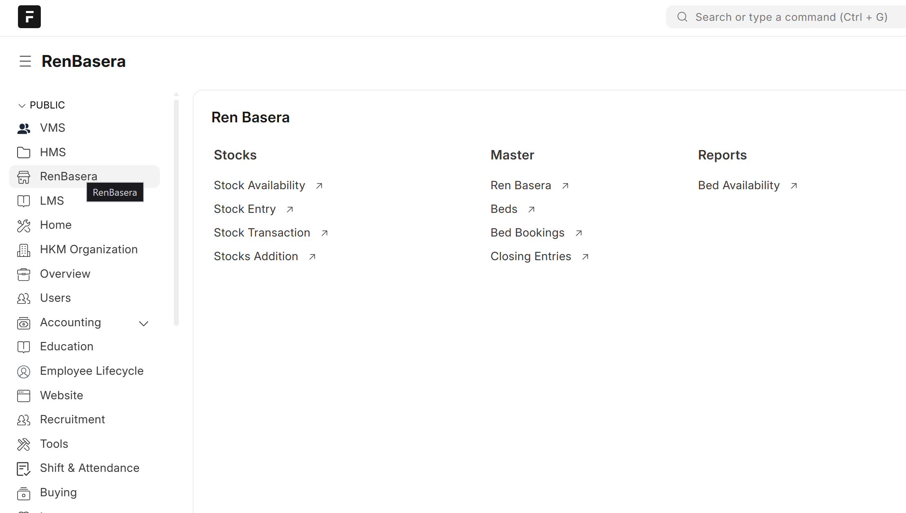
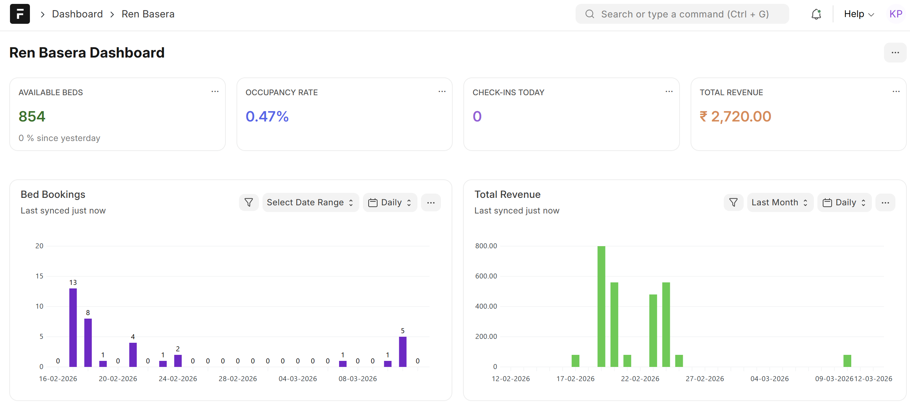
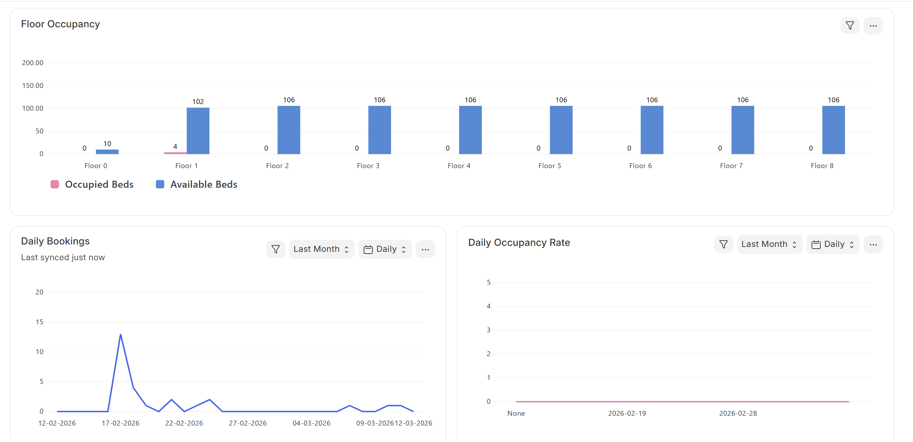

<<<<<<< HEAD
### Intern Test

App for interns to test and learn frappe and its modules

### Installation

You can install this app using the [bench](https://github.com/frappe/bench) CLI:

```bash
cd $PATH_TO_YOUR_BENCH
bench get-app $URL_OF_THIS_REPO --branch develop
bench install-app intern_test
```

### Contributing

This app uses `pre-commit` for code formatting and linting. Please [install pre-commit](https://pre-commit.com/#installation) and enable it for this repository:

```bash
cd apps/intern_test
pre-commit install
```

Pre-commit is configured to use the following tools for checking and formatting your code:

- ruff
- eslint
- prettier
- pyupgrade

### CI

This app can use GitHub Actions for CI. The following workflows are configured:

- CI: Installs this app and runs unit tests on every push to `develop` branch.
- Linters: Runs [Frappe Semgrep Rules](https://github.com/frappe/semgrep-rules) and [pip-audit](https://pypi.org/project/pip-audit/) on every pull request.


### License

mit
=======
# RenBasera Frappe System

A Ren Basera (Shelter Management) system built using the Frappe Framework.

## Features
- Floor and bed occupancy tracking
- Check-in / Check-out management
- Resident records
- Delivery and dispatch logs
- Custom DocTypes and APIs

## Tech Stack
- Frappe Framework
- Python
- MariaDB
- JavaScript

## Installation
Clone the repository inside your frappe bench apps folder.

git clone https://github.com/KaushalPawar14/RenBasera-Frappe-System.git

bench get-app RenBasera-Frappe-System
bench --site your-site-name install-app intern_test
>>>>>>> 8dec760a51b409d1545cd14aed3553da9b116e85

## Screenshots

### Workspace


### Dashboard-1


### Dashboard-2

