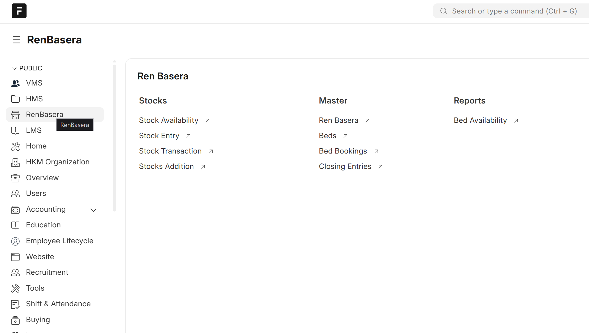
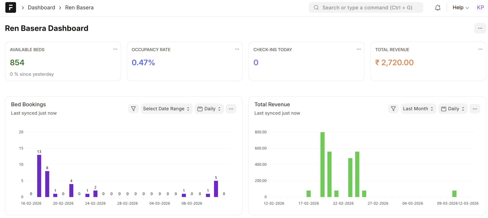
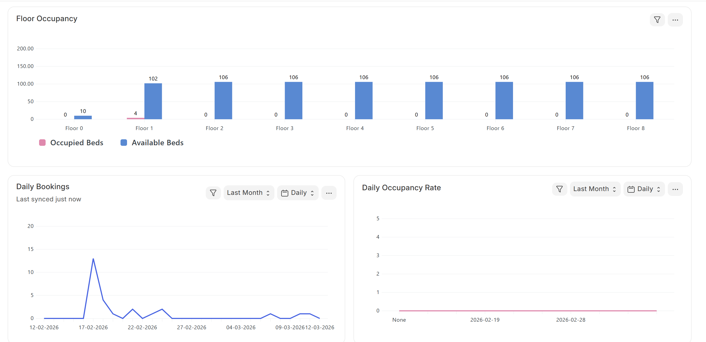

# Ren Basera — Shelter Management System (Frappe)

A custom Frappe app for running *Ren Basera* night shelters. It handles bed allotment, check-in and check-out with automatic billing, daily cash closing, stock tracking, and occupancy dashboards.

## Overview

A Ren Basera is a shelter where the relatives of admitted patients can stay. In this app every booking (**Bed Allotment**) stores the patient's name and hospital case number, and each relative staying with them is a guest row assigned to a specific bed. The system tracks which beds are free, bills each guest for their stay, and rolls the day's checked-out bookings into a daily closing record, split into cash and online payments.

The repository also contains a second module, **TSF Operation**. It covers tiffin (meal) dispatch logistics: dispatch challans, security gate checks, and delivery and return-trip logs. It comes with a Vue 3 + frappe-ui PWA frontend.

The installable Frappe app is named **`intern_test`** (see `intern_test/hooks.py` and `pyproject.toml`). It contains two modules, `Intern Test` (Ren Basera) and `TSF Operation`.

## Screenshots

### Workspace


### Occupancy dashboard


### Check-in dashboard


## Features

### Ren Basera (shelter)
- **Multiple shelters and floors.** Each shelter (`Ren Basera`) has its own beds, with floors 0 to 8, and is assigned an operator user.
- **Workflow-driven bookings.** A Bed Allotment moves through Draft → Checked-In → Checked-Out → Consolidated (or Cancelled). Moving to Checked-In marks the assigned beds as *Occupied* and stamps the check-in date and time. The operator who created the booking and the user who checked it out are recorded automatically.
- **Double-booking guard.** A booking is rejected if any of its beds is already held by a guest in another booking who has not checked out.
- **Whole or partial checkout.** Staff can check out the whole booking or only selected beds (`particular_checkout`). Freed beds go back to *Available*, and the booking closes itself once the last guest leaves.
- **Stay-based billing.** Each guest is billed per day at ₹80, where any part of a 24-hour block counts as a full day. Stay hours, billable days and amount are stored on each guest row, and the booking total is recalculated.
- **Checkout extension and audit trail.** Staff can extend the checkout date, which requires the new date to be later than the current one and takes remarks. If a guest leaves before the planned date, the checkout date is adjusted automatically. Both changes are logged as timeline comments on the booking.
- **Daily closing.** A "fetch checked-out bookings" button pulls the day's completed bookings into a closing sheet and totals them as cash or online. Closing the sheet moves each booking to *Consolidated* through the workflow API.
- **Stock management.** Stock purchases and stock entries increase the available quantity of each item. Issue and receive transactions go through an approval step, are checked so stock never goes negative or is over-received, and are reversed if cancelled.
- **Reporting and dashboards:**
  - The *Bed Availability* script report shows available beds per shelter and floor for each day in a chosen date range. Non-admin operators only see the shelter assigned to them.
  - The *Ren Basera* dashboard has number cards (Available Beds, Check-ins Today, Occupancy Rate, Total Revenue) and charts (Bed Bookings, Daily Bed Bookings, Total Revenue, Floor Occupancy, Daily Occupancy Rate). The last two use custom chart sources backed by SQL aggregation in `intern_test/api.py`.

### TSF Operation (tiffin dispatch)
- **Dispatch challans.** A challan records the vehicle, driver, the tiffin items loaded and the list of delivery centers. It moves through Draft → Pending Security Check → Dispatched → Returning → Completed (or Cancelled).
- **Security check.** A security check record is created automatically when a challan is sent for checking. Gate staff then confirm what goes out (delivery-out) and what comes back (delivery-in).
- **Delivery and return-trip logs** are kept for each challan.
- **Role-based Vue PWA** (`frontend/`), built with Vue 3, vue-router, frappe-ui and vite-plugin-pwa. It has pages for Login, Dashboard, Dispatch Challan, Challan Detail, Security Check, Delivery Log and Return Trip. Access is limited by route guards for these roles: TSF Admin, TSF Distribution Manager, TSF Supervisor and TSF Security Guard.

## Data model

| DocType | Module | Purpose |
|---|---|---|
| Ren Basera | Intern Test | A shelter: name, city, address, contact details, active flag, assigned operator |
| Bed | Intern Test | A bed in a shelter, with its floor and status (Available / Occupied / Cancelled) |
| Bed Allotment | Intern Test | A booking: patient name, case number, address, planned check-in/out dates, payment method (Cash/Online), guest table (`Relatives`), total amount |
| Ren Basera Daily Closing | Intern Test | End-of-day consolidation of checked-out bookings, with cash, online and total amounts |
| RNB Stock Entry | Intern Test | A goods-received entry (supplier, remarks) that adds purchased quantities to stock |
| RNB Stock Purchase | Intern Test | Purchase bill lines, with the line total and purchase date filled in automatically |
| RNB Stock Availability | Intern Test | One row per item: total purchased, total issued, available quantity |
| RNB Stock Transaction | Intern Test | An approval-gated issue or receive of stock against availability |
| TSF Dispatch Challan | TSF Operation | A vehicle dispatch: driver, tiffin items loaded, centers served, tiffins sent |
| TSF Security Check | TSF Operation | Gate verification of the items going out and coming back for a challan |
| TSF Delivery Log | TSF Operation | Per-challan delivery details and return-trip details |

## APIs

All of these are `@frappe.whitelist()` methods, called at `/api/method/<path>`.

| Method | Purpose |
|---|---|
| `intern_test.api.get_floor_occupancy_chart` | Occupied and available beds per floor (chart data) |
| `intern_test.api.get_daily_occupancy_rate` | Daily occupancy percentage (chart data) |
| `intern_test.intern_test.doctype.bed_allotment.bed_allotment.whole_checkout` | Check out every remaining guest, bill them and free their beds |
| `intern_test.intern_test.doctype.bed_allotment.bed_allotment.particular_checkout` | Check out the selected beds only |
| `intern_test.intern_test.doctype.bed_allotment.bed_allotment.checkout` | Legacy entry point that routes to whole or partial checkout |
| `intern_test.intern_test.doctype.bed_allotment.bed_allotment.extend_checkout` | Extend the checkout date and log remarks on the timeline |
| `intern_test.intern_test.doctype.ren_basera_daily_closing.ren_basera_daily_closing.fetch_checked_out_bookings` | List checked-out bookings for the daily closing |
| `intern_test.tsf_operation.api.login.login` | Guest-accessible login that returns the user's API key and secret, profile and roles |
| `intern_test.tsf_operation.api.create_challan.create_challan` | Create a dispatch challan |
| `intern_test.tsf_operation.api.change_state.change_state` | Send a Draft challan to security check |
| `intern_test.tsf_operation.api.cancel_challan.cancel_challan` | Cancel a challan that is not yet completed |
| `intern_test.tsf_operation.api.complete_challan.complete_challan` | Complete a challan that is in the Returning state |
| `intern_test.tsf_operation.api.submit_delivery_out.submit_delivery_out` | Record the security check for items going out |
| `intern_test.tsf_operation.api.submit_delivery_in.submit_delivery_in` | Record the security check for items coming back |

## Tech stack

- **Backend:** Python and the Frappe Framework (DocTypes, workflows, script reports, dashboard charts and number cards)
- **Database:** MariaDB, with raw SQL used for occupancy and report aggregation
- **Desk UI:** Frappe client scripts in JavaScript (custom buttons, dialogs, workflow confirmations)
- **Frontend (TSF):** Vue 3, vue-router, frappe-ui, Vite, vite-plugin-pwa

## Installation

This app needs a working [Frappe bench](https://github.com/frappe/bench) (Frappe v15).

```bash
cd ~/frappe-bench
bench get-app https://github.com/KaushalPawar14/RenBasera-Frappe-System.git
bench --site your-site.local install-app intern_test
bench --site your-site.local migrate
bench start
```

The workflows (Bed Allotment, Daily Closing, stock transactions, dispatch challans) and some linked child or master DocTypes (for example `Relatives`, `RNB Stock`, `TSF Vehicle`, `TSF Driver`) are not exported as fixtures in this repository. You need to create them on the site before the full flow will run.

To run the TSF frontend:

```bash
cd frontend
npm install
npm run dev   # set the /api proxy target in vite.config.js to your bench URL
```

## Author

**Kaushal Pawar** — [Portfolio](https://portfolio-kaushal-chi.vercel.app)

Licensed under the MIT License.
